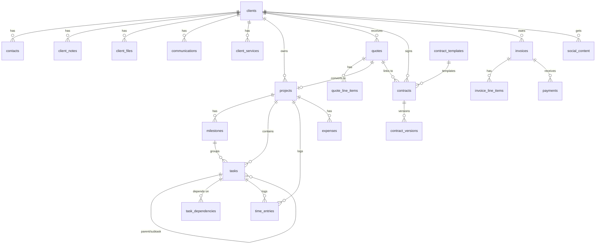

# Agency Zero — Database Plan (Preliminary)

Preliminary entity plan for the Supabase/Postgres database. This is a **living design document** —
actual migrations (Phase 1 onward) become the source of truth once they exist; update this file to stay in sync.
Field lists below are indicative, not exhaustive.

Status labels: `Phase 1–8` = core build · `Later` = client portal phase · `Future` = integration phase.

---

## 1. Conventions

- Primary keys: `uuid` (default `gen_random_uuid()`).
- Every table: `created_at timestamptz default now()`, `updated_at timestamptz default now()`.
- Money: `integer` **minor units (cents)** + `currency text` (default from settings). Never floats. (D-012)
- Durations: one convention app-wide — **minutes** in the DB, rendered as hours in the UI. Finalize at Phase 1 and note in DECISIONS.md.
- All timestamps in UTC.
- Statuses as Postgres enums or check constraints, defined once.
- Soft delete (`deleted_at`) only where history matters (clients, projects); hard delete elsewhere.
- Single-owner app: RLS policy is "owner user only" for internal tables; public token routes are the exception (§12).

---

## 2. Identity & Settings

### `profiles` — Phase 1
The agency owner (extends Supabase Auth user).

- `id uuid` (= auth.users.id)
- `full_name text`, `timezone text`, `currency text`
- `default_daily_capacity_minutes int` (fallback for workload)

### `settings` — Phase 1 (single row)
- `business_name text`, `address text`, `tax_id text`
- `default_currency text`, `default_tax_rate numeric`, `quote_prefix text`, `invoice_prefix text`

### `services` — Phase 2
Catalog of agency services (software dev, custom CRMs, websites, SEO, Meta ads, social media management, social video creation).

- `id`, `name text`, `description text`, `default_billing text` (one_off | recurring), `active bool`

---

## 3. Clients & Communication — Phase 2

### `clients`
- `id`, `name text`, `status client_status` (lead | active | past | archived)
- `company text`, `email text`, `phone text`, `website text`
- `notes_summary text` (optional rollup; detail lives in `client_notes`)
- `source text` (how acquired), `deleted_at timestamptz null`

### `contacts`
- `id`, `client_id → clients`, `name`, `role text`, `email`, `phone`, `is_primary bool`

### `client_notes`
- `id`, `client_id → clients`, `body text`, `pinned bool`

### `client_files`
- `id`, `client_id → clients`, `file_name text`, `storage_path text` (Supabase Storage), `mime_type`, `size_bytes`

### `communications`
One row per logged interaction (call, email, meeting, message — manual logging first; automation is a backlog idea).

- `id`, `client_id → clients`, `contact_id → contacts null`, `channel comm_channel` (call | email | meeting | message | other)
- `direction` (in | out), `summary text`, `occurred_at timestamptz`

### `client_services`
Which services the agency provides to which client.

- `id`, `client_id → clients`, `service_id → services`, `billing one_off | recurring`, `monthly_amount_cents int null`, `started_on date`

---

## 4. Projects & Tasks — Phase 3

### `projects`
- `id`, `client_id → clients`, `name text`, `description text`
- `status project_status` (planning | active | on_hold | completed | cancelled)
- `value_cents int`, `estimated_minutes int`, `actual_minutes int` (or derived from `time_entries`)
- `starts_on date null`, `deadline date null`, `progress int` (0–100, manual or milestone-derived)

### `milestones`
- `id`, `project_id → projects`, `name text`, `due_date date null`, `completed_at timestamptz null`, `sort_order int`

### `tasks`
- `id`, `project_id → projects null` (tasks may be standalone), `milestone_id → milestones null`
- `parent_task_id → tasks null` (subtasks)
- `title text`, `description text`
- `status task_status` (todo | in_progress | blocked_waiting_client | blocked_other | done | cancelled)
- `priority` (low | medium | high | urgent)
- `due_date date null`, `estimated_minutes int null`, `actual_minutes int null`
- `depends_on_task_id → tasks null` (simple chain) — plus `task_dependencies` below if many-to-many needed
- `recurrence_rule jsonb null` (RRULE-style; see `recurring_tasks`)

### `task_dependencies`
- `task_id → tasks`, `depends_on_task_id → tasks` (a task can depend on multiple predecessors)

### `recurring_tasks`
Template + schedule for recurring tasks.

- `id`, `template jsonb` (task field defaults), `recurrence_rule text` (RRULE), `next_run date`, `active bool`

### `time_entries`
Source of truth for actual time (manual entry first; timer is a backlog idea).

- `id`, `task_id → tasks null`, `project_id → projects null`, `minutes int`, `worked_on date`, `note text`

---

## 5. Workload, Calendar & Reminders — Phase 4

### `workday_capacity`
Available work hours per day (specific dates override weekday defaults).

- `date date` (unique), `available_minutes int`

### `weekly_capacity`
- `weekday smallint` (0–6), `available_minutes int`

### `calendar_events`
Meetings and planned work blocks (deadlines/tasks/milestones are read from their own tables; only meetings/blocks are stored here).

- `id`, `title text`, `type cal_event_type` (meeting | work_block | other)
- `starts_at timestamptz`, `ends_at timestamptz`
- `client_id null`, `project_id null`, `task_id null`, `notes text`
- `external_id text null` + `provider text null` (Google Calendar sync later — `Future`)

### `reminders`
Polymorphic reminder engine powering MASTER_SPEC §4.13.

- `id`, `kind reminder_kind` (task_due_soon | task_overdue | client_no_response | quote_awaiting_response | contract_unsigned | invoice_due | invoice_overdue | project_deadline_approaching | schedule_overloaded | custom)
- `subject_type text null`, `subject_id uuid null` (polymorphic link)
- `due_at timestamptz`, `done bool`, `message text`

---

## 6. Sales: Quotes, Contracts, Invoices, Payments — Phase 5

### `quotes`
- `id`, `client_id → clients`, `number text unique`, `status quote_status` (draft | sent | viewed | accepted | rejected | expired)
- `issued_on date`, `valid_until date null`
- `subtotal_cents`, `discount_cents` (or `discount_pct`), `tax_cents` / `tax_rate numeric`, `total_cents`
- `public_token text unique` (secure public link), `token_expires_at null`
- `viewed_at timestamptz null`, `accepted_at null`, `rejected_at null`
- `converted_project_id → projects null` (set when accepted quote becomes a project)

### `quote_line_items`
- `id`, `quote_id → quotes`, `sort_order int`, `description text`
- `qty numeric`, `unit_amount_cents int`, `is_recurring bool`, `billing_period month | quarter | year null`, `amount_cents int`

### `contracts`
- `id`, `client_id → clients`, `quote_id null`, `project_id null`
- `title text`, `status contract_status` (draft | sent | signed | void)
- `body text` (or markdown), `template_id → contract_templates null`, `version int`
- `public_token text unique`, `signed_at timestamptz null`, `signer_name text null`
- `signed_file_path text null` (PDF snapshot in Supabase Storage)

### `contract_versions`
Version history; immutable rows.

- `id`, `contract_id → contracts`, `version int`, `body text`, `created_at`

### `contract_templates`
- `id`, `name text`, `body text` (with `{{placeholders}}`), `active bool`

### `invoices`
- `id`, `client_id → clients`, `project_id null`, `quote_id null`, `contract_id null`
- `number text unique`, `status invoice_status` (draft | sent | partially_paid | paid | overdue | void)
- `issued_on date`, `due_on date`
- `subtotal_cents`, `discount_cents`, `tax_cents`, `total_cents`
- `deposit_cents int null` (requested deposit), `paid_cents int` (derived from payments, may be cached)
- `balance_cents` (total − paid), `public_token text unique null`

### `invoice_line_items`
- `id`, `invoice_id → invoices`, `sort_order`, `description`, `qty`, `unit_amount_cents`, `amount_cents`

### `payments`
Manual recording first; Stripe later (`Future`).

- `id`, `invoice_id → invoices`, `amount_cents int`, `paid_on date`
- `method payment_method` (bank_transfer | cash | card | other | stripe)
- `kind payment_kind` (deposit | partial | full), `reference text null`, `note text`

### `expenses`
Feeds profitability (§4.15).

- `id`, `client_id null`, `project_id null`, `vendor text`, `category text`, `amount_cents int`, `spent_on date`, `note text`, `receipt_path null`

---

## 7. Social Media — Phase 7

### `social_content`
One pipeline row per content piece: ideas → scripts → filming → editing → client approval → scheduled → published.

- `id`, `client_id → clients`, `project_id null`
- `stage content_stage` (idea | script | filming | editing | client_approval | scheduled | published)
- `title text`, `platforms text[]`, `script text`, `notes text`
- `asset_paths text[]` (Supabase Storage: raw footage, edits, captions)
- `approval_status` (not_requested | pending | approved | changes_requested), `approved_at null`
- `scheduled_for timestamptz null`, `published_at null`, `post_url text null`
- (Analytics fields deferred — `Future`, see IDEAS_BACKLOG §3)

---

## 8. Profitability — Phase 8 (mostly derived)

No new core tables required; computed from `payments`, `invoices`, `expenses`, `time_entries`, `projects`.
Optionally a materialized view per client/project: revenue, expenses, est vs actual hours, effective hourly rate.

---

## 9. Client Portal — Later

### `portal_access` — Later
- `id`, `client_id → clients`, `email text`, `status` (invited | active | disabled)
- `auth_user_id uuid null` (Supabase Auth user for the client) **or** token-based access — decide at Phase 9

### `portal_requests` — Later
"Items we are waiting on" / client requests.

- `id`, `client_id`, `project_id null`, `direction` (waiting_on_client | client_request), `body text`, `status` (open | done), `due_date null`

### `approvals` — Later (generalized; social approval reuses this)
- `id`, `client_id`, `subject_type text`, `subject_id uuid`, `decision` (pending | approved | rejected), `decided_at null`, `note text`

---

## 10. Integrations — Future

### `integrations`
- `id`, `provider` (stripe | google_calendar | meta | search_console | ga4)
- `status`, `credentials jsonb` (encrypted / secrets manager), `connected_at`, `last_synced_at`
- `client_id null` (for per-client connections like Meta ad accounts)

### `meta_ad_accounts` / `meta_campaigns` / `meta_adsets` / `meta_ads` / `meta_metrics` — Future
Mirror of Meta objects + daily metric rows (spend, impressions, clicks, CTR, CPC, CPM, leads, CPL, CPA, ROAS, frequency) keyed by object + date.

### `seo_properties` / `seo_queries` / `seo_pages` / `seo_metrics` — Future
Search Console + GA4 mirrors: queries, pages, clicks, impressions, position, conversions by date.

### `ai_actions` — Future (approval flow)
- `id`, `kind` (ad_change | other), `proposal jsonb`, `status` (proposed | approved | rejected | executed | failed)
- `requires_approval bool default true` — enforces D-008 at the schema level.

---

## 11. Entity relationship overview (high level)

---

## 12. Security model summary

| Surface | Access |
|---|---|
| Internal app tables | RLS: only the owner's authenticated user |
| Public quote link (`/q/[token]`) | Anonymous read of one quote by token; writes only to accept/reject + viewed_at |
| Public contract link (`/c/[token]`) | Anonymous read of one contract by token; write only to sign (sets signed_at, stores snapshot) |
| Client portal (Later) | Per-client Supabase Auth user or token; RLS scoped to own client_id only |
| Integrations secrets | Server-side only, never exposed to the browser |

Tokens: long random strings (e.g. 32+ bytes), stored hashed where feasible, revocable, optional expiry.
