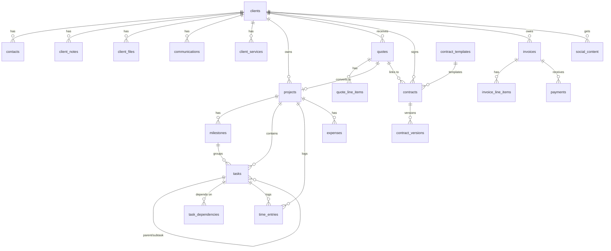

# Agency Zero — Database Plan (Preliminary)

Preliminary entity plan for the Supabase/Postgres database. This is a **living design document** —
actual migrations (Phase 1 onward) become the source of truth once they exist; update this file to stay in sync.
Field lists below are indicative, not exhaustive.

Status labels: `Phase 1–8` = core build · `Later` = client portal phase · `Future` = integration phase.

---

## 1. Conventions

- Primary keys: `uuid` (default `gen_random_uuid()`).
- Every table: `created_at timestamptz default now()`, `updated_at timestamptz default now()`.
- Money: `integer` **minor units (cents)** + `currency text` (default from settings). Never floats. (D-012)
- Durations: one convention app-wide — **minutes** in the DB, rendered as hours in the UI. Finalize at Phase 1 and note in DECISIONS.md.
- All timestamps in UTC.
- Statuses as Postgres enums or check constraints, defined once.
- Soft delete (`deleted_at`) only where history matters (clients, projects); hard delete elsewhere.
- Single-owner app: RLS policy is "owner user only" for internal tables; public token routes are the exception (§12).

---

## 2. Identity & Settings — `profiles` + `settings` ✅ migrated (0001); `services` ✅ migrated (0005), extended (0010)

### `profiles` — Phase 1
The agency owner (extends Supabase Auth user).

- `id uuid` (= auth.users.id)
- `full_name text`, `timezone text`, `currency text`
- `default_daily_capacity_minutes int` (fallback for workload)

### `settings` — Phase 1 (single row)
- `business_name text`, `address text`, `tax_id text`
- `default_currency text`, `default_tax_rate numeric`, `quote_prefix text`, `invoice_prefix text`

### `services` — Phase 2 ✅ migrated (0005), extended (0010)

Custom-services pass adds `default_price_cents` (integer cents, D-012),
`billing_interval` (`monthly` | `quarterly` | `yearly`, default `monthly`) for
recurring services, and `default_estimated_minutes` (minutes, D-015) as the
default estimate a task or assignment inherits. Services are archived with
`active = false`, never deleted, so historical assignments and quote lines keep
their meaning.
Catalog of agency services (software dev, custom CRMs, websites, SEO, Meta ads, social media management, social video creation).

- `id`, `name text`, `description text`, `default_billing text` (one_off | recurring), `active bool`

---

## 3. Clients & Communication — Phase 2 (`clients` ✅ migrated in 0002; contacts/notes/files/communications/client_services ✅ migrated in 0005)

### `clients`
- `id`, `name text`, `status client_status` (lead | active | past | archived)
- `company text`, `email text`, `phone text`, `website text`
- `notes_summary text` (optional rollup; detail lives in `client_notes`)
- `source text` (how acquired), `deleted_at timestamptz null`

### `contacts`
- `id`, `client_id → clients`, `name`, `role text`, `email`, `phone`, `is_primary bool`

### `client_notes`
- `id`, `client_id → clients`, `body text`, `pinned bool`

### `client_files`
- `id`, `client_id → clients`, `file_name text`, `storage_path text` (private Supabase Storage `client-files` bucket), `mime_type`, `size_bytes`

### `communications`
One row per logged interaction (call, email, meeting, message — manual logging first; automation is a backlog idea).

- `id`, `client_id → clients`, `contact_id → contacts null`, `channel comm_channel` (call | email | meeting | message | other)
- `direction` (in | out), `summary text`, `occurred_at timestamptz`

### `client_services`
Which services the agency provides to which client.

- `id`, `client_id → clients`, `service_id → services`, `billing one_off | recurring`, `monthly_amount_cents int null`, `started_on date`

---

### `project_notes` / `project_files` — Phase 3 ✅ migrated (0013)

Per-project notes (`body`, `pinned`) and file metadata (`file_name`,
`storage_path`, `mime_type`, `size_bytes`) for the project workspace. Files live
in the private `client-files` bucket under `projects/<project_id>/…` and are
served by the same expiring signed URLs as client files; both tables cascade on
project delete and are owner-only under RLS (D-014).

## 4. Projects & Tasks — Phase 3 (`projects` ✅ migrated in 0003; `tasks` ✅ migrated in 0004; milestones / dependencies / recurring / time entries ✅ migrated in 0005)

### `projects`
- `id`, `client_id → clients`, `name text`, `description text`
- `status project_status` (planning | active | on_hold | completed | cancelled)
- `value_cents int`, `estimated_minutes int`, `actual_minutes int` (or derived from `time_entries`)
- `starts_on date null`, `deadline date null`, `progress int` (0–100, manual or milestone-derived)

### `milestones`
- `id`, `project_id → projects`, `name text`, `due_date date null`, `completed_at timestamptz null`, `sort_order int`

### `tasks`
- `id`, `project_id → projects null` (tasks may be standalone), `client_id → clients null`, `milestone_id → milestones null` *(added in 0005)*
- `parent_task_id → tasks null` (subtasks)
- `title text`, `description text`
- `status task_status` (todo | in_progress | blocked_waiting_client | blocked_other | done | cancelled)
- `priority` (low | medium | high | urgent)
- `due_date date null`, `estimated_minutes int null`, `actual_minutes int null`
- `depends_on_task_id → tasks null` (simple chain) — plus `task_dependencies` below if many-to-many needed
- `recurrence_rule jsonb null` (RRULE-style; see `recurring_tasks`)

### `task_dependencies`
- `task_id → tasks`, `depends_on_task_id → tasks` (a task can depend on multiple predecessors)

### `recurring_tasks`
Template + schedule for recurring tasks.

- `id`, `template jsonb` (task field defaults), `recurrence_rule text` (RRULE), `next_run date`, `active bool`

### `time_entries`
Source of truth for actual time (manual entry first; timer is a backlog idea).

- `id`, `task_id → tasks null`, `project_id → projects null`, `minutes int`, `worked_on date`, `note text`

---

## 5. Workload, Calendar & Reminders — Phase 4 ✅ migrated in 0007

### `workday_capacity` ✅ migrated (0007)
Available work hours per day (specific dates override weekday defaults).

- `date date` (unique), `available_minutes int`

### `weekly_capacity` ✅ migrated (0007)
- `weekday smallint` (0–6), `available_minutes int

### `calendar_events` ✅ migrated (0007)
Meetings and planned work blocks (deadlines/tasks/milestones are read from their own tables; only meetings/blocks are stored here).

- `id`, `title text`, `type calendar_event_type` (meeting | work_block | other)
- `starts_at timestamptz`, `ends_at timestamptz`
- `client_id null`, `project_id null`, `task_id null`, `notes text`
- `external_id text null` + `provider text null` (Google Calendar sync later — `Future`)

### `reminders` ✅ migrated (0007)
Polymorphic reminder engine powering MASTER_SPEC §4.13.

- `id`, `kind reminder_kind` (task_due_soon | task_overdue | client_no_response | quote_awaiting_response | contract_unsigned | invoice_due | invoice_overdue | project_deadline_approaching | schedule_overloaded | custom)
- `subject_type text null`, `subject_id uuid null` (polymorphic link)
- `due_at timestamptz`, `done bool`, `message text`

---

## 6. Sales: Quotes, Contracts, Invoices, Payments — Phase 5 ✅ migrated in 0006

### `quotes` ✅ migrated (0006)
- `id`, `client_id → clients`, `number text unique`, `title`, `notes`, `status quote_status` (draft | sent | viewed | accepted | rejected | expired)
- `issued_on date`, `valid_until date null`
- `subtotal_cents`, `discount_cents` (or `discount_pct`), `tax_cents` / `tax_rate numeric`, `total_cents`
- `public_token text unique`, `public_token_hash text unique` (secure public link, rotatable via owner action), `token_expires_at null`
- `viewed_at timestamptz null`, `accepted_at null`, `rejected_at null`, `responded_by text null` *(0008, optional customer name recorded with the response)*
- `selected_item_ids uuid[]` *(0008)*, `accepted_subtotal_cents int null`, `accepted_total_cents int null` *(0008 — frozen snapshot of the customer's accepted selection, computed server-side)*
- `converted_project_id → projects null` (set when accepted quote becomes a project)

### `quote_line_items` ✅ migrated (0006; extended in 0008)
- `id`, `quote_id → quotes`, `sort_order int`, `description text`, `details text null` *(0008)*
- `qty numeric`, `unit_amount_cents int`, `is_recurring bool`, `billing_period month | quarter | year null`, `amount_cents int`
- `selection text` *(0008)*: `fixed` (always included) · `optional` (customer checkbox add-on) · `choice` (mutually exclusive pick-one inside `option_group`, i.e. packages). `choice` requires `option_group`.
- `option_group text null` *(0008)* — package/option group label shared by competing `choice` items.

### `contracts` ✅ migrated (0006)
- `id`, `client_id → clients`, `quote_id null`, `project_id null`
- `title text`, `status contract_status` (draft | sent | signed | void)
- `body text` (or markdown), `template_id → contract_templates null`, `version int`
- `public_token text unique`, `public_token_hash text unique`, `signed_at timestamptz null`, `signer_name text null`
- `signed_snapshot text null` (preserved text/markdown document at signing), `signed_file_path text null` (optional PDF snapshot in Supabase Storage)

### `contract_versions` ✅ migrated (0006)
Version history; immutable rows.

- `id`, `contract_id → contracts`, `version int`, `body text`, `created_at`

### `contract_templates` ✅ migrated (0006)
- `id`, `name text`, `body text` (with `{{placeholders}}`), `active bool`

### `invoices` ✅ migrated (0006)
- `id`, `client_id → clients`, `project_id null`, `quote_id null`, `contract_id null`
- `number text unique`, `status invoice_status` (draft | sent | partially_paid | paid | overdue | void)
- `issued_on date`, `due_on date`
- `subtotal_cents`, `discount_cents`, `tax_cents`, `total_cents`
- `deposit_cents int null` (requested deposit), `paid_cents int` (derived from payments, may be cached)
- `balance_cents` (total − paid), `public_token text unique null`

### `invoice_line_items` ✅ migrated (0006)
- `id`, `invoice_id → invoices`, `sort_order`, `description`, `qty`, `unit_amount_cents`, `amount_cents`

### `payments` ✅ migrated (0006)
Manual recording first; Stripe later (`Future`).

- `id`, `invoice_id → invoices`, `amount_cents int`, `paid_on date`
- `method payment_method` (bank_transfer | cash | card | other | stripe)
- `kind payment_kind` (deposit | partial | full), `reference text null`, `note text`

### `expenses`
Feeds profitability (§4.15).

- `id`, `client_id null`, `project_id null`, `vendor text`, `category text`, `amount_cents int`, `spent_on date`, `note text`, `receipt_path null`

---

## 7. Social Media — Phase 7

### `social_content`
One pipeline row per content piece: ideas → scripts → filming → editing → client approval → scheduled → published.

- `id`, `client_id → clients`, `project_id null`
- `stage content_stage` (idea | script | filming | editing | client_approval | scheduled | published)
- `title text`, `platforms text[]`, `script text`, `notes text`
- `asset_paths text[]` (Supabase Storage: raw footage, edits, captions)
- `approval_status` (not_requested | pending | approved | changes_requested), `approved_at null`
- `scheduled_for timestamptz null`, `published_at null`, `post_url text null`
- (Analytics fields deferred — `Future`, see development/IDEAS.md §3)

---

## 8. Profitability — Phase 8 (mostly derived)

No new core tables required; computed from `payments`, `invoices`, `expenses`, `time_entries`, `projects`.
Optionally a materialized view per client/project: revenue, expenses, est vs actual hours, effective hourly rate.

---

## 9. Client Portal — Later

### `portal_access` — Later
- `id`, `client_id → clients`, `email text`, `status` (invited | active | disabled)
- `auth_user_id uuid null` (Supabase Auth user for the client) **or** token-based access — decide at Phase 9

### `portal_requests` — Later
"Items we are waiting on" / client requests.

- `id`, `client_id`, `project_id null`, `direction` (waiting_on_client | client_request), `body text`, `status` (open | done), `due_date null`

### `approvals` — Later (generalized; social approval reuses this)
- `id`, `client_id`, `subject_type text`, `subject_id uuid`, `decision` (pending | approved | rejected), `decided_at null`, `note text`

---

## 10. Integrations — Future

### `integrations`
- `id`, `provider` (stripe | google_calendar | meta | search_console | ga4)
- `status`, `credentials jsonb` (encrypted / secrets manager), `connected_at`, `last_synced_at`
- `client_id null` (for per-client connections like Meta ad accounts)

### `meta_ad_accounts` / `meta_campaigns` / `meta_adsets` / `meta_ads` / `meta_metrics` — Future
Mirror of Meta objects + daily metric rows (spend, impressions, clicks, CTR, CPC, CPM, leads, CPL, CPA, ROAS, frequency) keyed by object + date.

### `seo_properties` / `seo_queries` / `seo_pages` / `seo_metrics` — Future
Search Console + GA4 mirrors: queries, pages, clicks, impressions, position, conversions by date.

### `ai_actions` — Future (approval flow)
- `id`, `kind` (ad_change | other), `proposal jsonb`, `status` (proposed | approved | rejected | executed | failed)
- `requires_approval bool default true` — enforces D-008 at the schema level.

---

## 11. Entity relationship overview (high level)

```mermaid
erDiagram
    clients ||--o{ contacts : has
    clients ||--o{ client_notes : has
    clients ||--o{ client_files : has
    clients ||--o{ communications : has
    clients ||--o{ client_services : has
    clients ||--o{ projects : owns
    clients ||--o{ quotes : receives
    clients ||--o{ contracts : signs
    clients ||--o{ invoices : owes
    clients ||--o{ social_content : gets
    projects ||--o{ milestones : has
    projects ||--o{ tasks : contains
    projects ||--o{ time_entries : logs
    projects ||--o{ expenses : has
    milestones ||--o{ tasks : groups
    tasks ||--o{ tasks : "parent/subtask"
    tasks ||--o{ task_dependencies : "depends on"
    tasks ||--o{ time_entries : logs
    quotes ||--o{ quote_line_items : has
    quotes ||--o| projects : "converts to"
    quotes ||--o{ contracts : "links to"
    invoices ||--o{ invoice_line_items : has
    invoices ||--o{ payments : receives
    contracts ||--o{ contract_versions : versions
    contract_templates ||--o{ contracts : templates
```

---

## 12. Security model summary

| Surface | Access |
|---|---|
| Internal app tables | RLS: only the owner's authenticated user |
| Public quote link (`/q/[token]`) | Anonymous read of one quote by token; writes only to accept/reject + viewed_at |
| Public contract link (`/c/[token]`) | Anonymous read of one contract by token; write only to sign (sets signed_at, stores snapshot) |
| Client portal (Later) | Per-client Supabase Auth user or token; RLS scoped to own client_id only |
| Integrations secrets | Server-side only, never exposed to the browser |

Tokens: long random strings (e.g. 32+ bytes), stored hashed where feasible, revocable, optional expiry.

---

## 13. Migration log

Applied-state record. Migrations in `supabase/migrations/` are the source of truth; keep this list in sync.

| Migration | Contents | Status |
|---|---|---|
| `0001_profiles_and_settings.sql` | `profiles`, `settings` (single row, `id = 1` check), `set_updated_at()` helper, `handle_new_user()` security-definer trigger (auto-creates profile + settings row on sign-up), RLS policies | ✅ Written (Phase 1) |
| `0002_clients.sql` | `client_status` enum, `clients` table (soft delete, email check, partial status index), RLS | ✅ Written (Phase 1) |
| `0003_projects.sql` | `project_status` enum, `projects` table (client FK cascade, `currency` per D-012, progress check, indexes), RLS | ✅ Written (Phase 1) |
| `0004_tasks.sql` | `task_status` + `task_priority` enums, `tasks` table (self-FK subtasks, `depends_on_task_id`, `recurrence_rule jsonb`, indexes), RLS | ✅ Written (Phase 1) |
| `0005_crm_core.sql` | `services`, `contacts`, `client_notes`, `client_files`, `communications`, `client_services`, `milestones`; task client/milestone assignment; `task_dependencies`, `recurring_tasks`, `time_entries`; private `client-files` Storage bucket and policies; RLS/triggers | ✅ Written (Phases 2–3) |
| `0006_sales.sql` | Quotes and quote line items; hashed public quote functions and acceptance/rejection; contract templates, contracts, immutable versions, hashed public signing functions; invoices, invoice line items, payments, payment totals/status triggers; RLS | ✅ Written (Phase 5) |
| `0007_planning_and_reminders.sql` | Task planned dates; weekly/date-specific capacity; calendar events; reminder rows; enums, indexes, updated-at triggers, RLS | ✅ Written (Phase 4) |
| `0009_sync_client_ready_sales` | **Not in this repository — live database only.** Applied out of band to the production project before this pass and never committed, so `0009` is intentionally skipped here to avoid a version collision. | ⚠️ Production-only (not in repo) |
| `0010_services_catalog.sql` | Custom service catalogue: `services.default_price_cents`, `services.billing_interval` (`monthly`/`quarterly`/`yearly`), `services.default_estimated_minutes`; `client_services.billing_interval` + `amount_cents` (backfilled from `monthly_amount_cents`); `public.normalized_monthly_cents(amount_cents, interval)` as the single MRR conversion; `quote_line_items.service_id`; `public.get_service_directory()` (assigned/recurring/one-off counts + normalized MRR per service) | ✅ Written (services pass) |
| `0011_dashboard_summary.sql` | `public.get_dashboard_summary(p_today date default null)` — one `security invoker` read for the whole dashboard: tasks due today, overdue tasks, open tasks, active projects, clients, waiting-on-client tasks (+ rows), upcoming deadlines (projects and incomplete milestones, 30 days), recent activity, and the recurring-revenue block (MRR, ARR = 12 × MRR, recurring client count, recurring service count, per-service breakdown) | ✅ Written (dashboard pass) |
| `0012_client_workspace.sql` | `public.get_client_directory()` (per client: assigned/recurring services, MRR, outstanding invoice balance, active/total projects, waiting/open tasks, last activity) and `public.get_client_workspace(p_client_id uuid)` (client + stats + contacts, projects, tasks, services, service catalogue, quotes, contracts, invoices, payments, notes, communications, files; `null` for an unknown id so the page can 404) | ✅ Written (clients redesign pass) |
| `0013_project_workspace.sql` | `project_notes` + `project_files` (owner-only RLS, updated-at triggers, cascade on project delete) and `public.get_project_workspace(p_project_id uuid)` (project, client, totals incl. actual vs estimated time and invoiced/paid/outstanding, tasks with parent/milestone names, milestones, time entries, notes, files, quotes, contracts, invoices, payments, client services, recent activity; `null` for an unknown id) | ✅ Written (project workspace pass) |
| `0014_owner_only_rls.sql` | `app_owner` singleton + `is_owner()`; every RLS/Storage policy rewritten to `is_owner()`; `handle_new_user()` makes the first user the owner; `convert_quote_to_project`/`refresh_invoice_statuses` check `is_owner()`. **Verify the owner is the oldest profile before applying to production.** | ✅ Written (2026-10-01) |
| `0015_transactional_saves_and_invoice_protection.sql` | `save_quote()` / `save_invoice()` atomic header+lines RPCs (security invoker); payments → invoice `ON DELETE RESTRICT`; trigger blocking deletion of non-draft invoices. | ✅ Written (2026-10-01) |
| `0016_payment_ledger_and_signature_evidence.sql` | `payments.voided_at`/`void_reason`; trigger forbidding payment delete/edit and un-voiding; invoice recalculation ignores voided payments and un-sticks `paid`→`partially_paid`/`sent`; workspace read models expose `voided_at` (patched in place); contract signature evidence columns (`signer_ip`, `signer_user_agent`, `consent_text`, `signed_body_sha256`), immutability extended, `sign_public_contract` now takes evidence arguments. | ✅ Written (2026-10-01) |
| `0017_invoice_summary.sql` | `get_invoice_summary(p_today)` — invoice KPIs over all invoices (revenue, outstanding excluding draft/void, overdue). | ✅ Written (2026-10-01) |
| `0008_security_hardening.sql` | `set_updated_at()` pinned to `search_path = public`; EXECUTE revoked on `handle_new_user()` and `recalculate_invoice_payment()`; quote line-item `details`/`option_group`/`selection` (packages/options/optional add-ons); quote selection snapshot columns (`responded_by`, `selected_item_ids`, accepted totals); extended `get_public_quote` + replacement `respond_public_quote` (validated selection, server-computed accepted totals); `mark_public_contract_viewed`; immutability triggers for accepted quotes, their line items, signed contracts, and contract versions; seeded "Standard services agreement" template | ✅ Written (production hardening pass) |

RLS pattern (D-014): RLS is enabled on every application table; internal policies are `to authenticated` with `(select auth.uid())` predicates. Public quote/contract access is implemented only through the narrow hashed-token security-definer functions in `0006` (extended in `0008`); no broad anonymous table policies are used. A fresh project applies `0001`
through `0008` and then `0010` through `0017` in numeric order (`0009` is
reserved for the production-only sync described above). Every function added in
`0010`–`0013` is `security invoker`, pins `search_path = public`, and has
EXECUTE revoked from `public`/`anon` and granted to `authenticated`.

Invoice overdue state (D-033): the stored `invoices.status` column is maintained
by the payments trigger, while the time-based `overdue` state is derived at read
time (`src/lib/invoice-status.ts`, and the read models above) so that rendering
a page never writes to the database. `public.refresh_invoice_statuses()` remains
available for a scheduled/back-office sweep.
